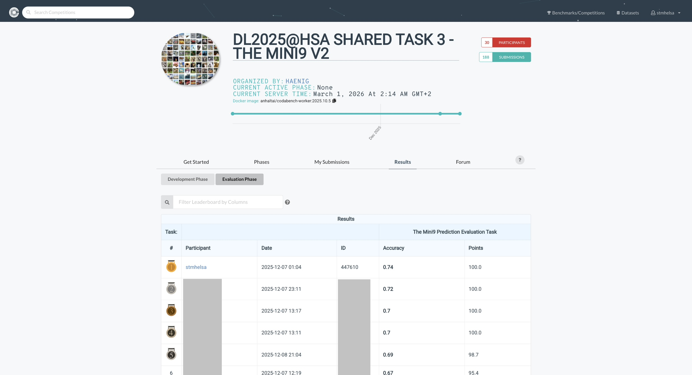

# 🧠 Mini9 Image Classification  
### ResNet + Advanced Regularization (MixUp / CutMix)

---

## 🏆 Competition Achievement

| Metric | Value |
|--------|--------|
| Final Accuracy | **0.74** |
| Baseline | 0.70 |
| Absolute Improvement | **+4%** |
| Participants | 30 |
| Score | 100 / 100 |

📌 The model exceeded the baseline and achieved maximum scoring performance.



---

## 🎯 Problem Statement

The objective of this task is to design a neural network capable of classifying **32×32 RGB images** into 9 object categories from the Mini9 dataset.

### Key Challenges

- Very small spatial resolution (32×32)
- Limited visual information per sample
- Class similarity (e.g., cat vs dog, truck vs automobile)
- Risk of overfitting

The evaluation metric is **Accuracy**.

Baseline accuracy: **70%**

---

## 🏗 Engineering Approach

Instead of using a large pretrained backbone, I designed a custom lightweight ResNet-style CNN tailored for low-resolution images.

Design philosophy:

- Residual connections → stable deep training
- Progressive channel expansion → hierarchical feature learning
- Stage-dependent dropout → structured regularization
- Strong data augmentation → improved generalization

---

## 🧠 Model Architecture

**Mini9ResNet (~11.17M parameters)**

```
Input (32×32×3)
│
├── Conv(3→64) + BN + ReLU
│
├── Layer1: 2 Residual Blocks (64)
├── Layer2: 2 Residual Blocks (128, stride=2)
├── Layer3: 2 Residual Blocks (256, stride=2)
├── Layer4: 2 Residual Blocks (512, stride=2)
│
├── AdaptiveAvgPool(1×1)
└── FC (512 → 9)
```

### Initialization Strategy

- Convolution → Kaiming Normal
- BatchNorm → weight=1, bias=0
- Linear → Normal(0, 0.01)

---

## 🔄 Data Strategy & Regularization

### Normalization

```python
mean = [0.5246, 0.5583, 0.5878]
std  = [0.1855, 0.1837, 0.1951]
```

### Online Augmentation

- RandomCrop (padding=4)
- RandomHorizontalFlip
- MixUp (α=1.0)
- CutMix (p=0.5)
- Label Smoothing (0.1)

MixUp and CutMix improve robustness by enforcing distributed representations and reducing overfitting.

---

## ⚙️ Training Configuration

| Component | Choice |
|------------|---------|
| Optimizer | SGD (momentum=0.9, Nesterov) |
| Learning Rate | 0.1 |
| Scheduler | CosineAnnealingLR |
| Weight Decay | 5e-4 |
| Epochs | 150 |
| Early Stopping | 25 patience |

Cosine annealing improves convergence stability and helps avoid sharp minima.

---

## 📊 Results

### Local Validation

Accuracy: **92.93%**

### Competition Evaluation

Accuracy: **0.74 (74%)**

The performance exceeded the 70% baseline and achieved full scoring.

---

## 📂 Repository Structure

```
├── CutMix.ipynb        # Full training pipeline
├── model.py            # Inference wrapper
├── best_model.pth      # Best checkpoint
├── EDA.ipynb           # Exploratory analysis
├── leaderboard.png
└── README.md
```

---

## 🚀 Reproducibility

Install dependencies:

```
pip install torch torchvision numpy pandas scikit-learn pillow matplotlib
```

Dataset layout:

```
train/class_name/*.jpg
val/class_name/*.jpg
```

Run the notebook sequentially.  
The best model checkpoint will be saved automatically.

---

## 🧩 Key Learnings

- For 32×32 images, augmentation strategy significantly impacts performance.
- MixUp and CutMix improve generalization under distribution shifts.
- Cosine LR scheduling stabilizes convergence.
- Strong regularization prevents leaderboard overfitting.

---

## 👤 Author

Mohamed Elsayed
M.Sc. Data Science
